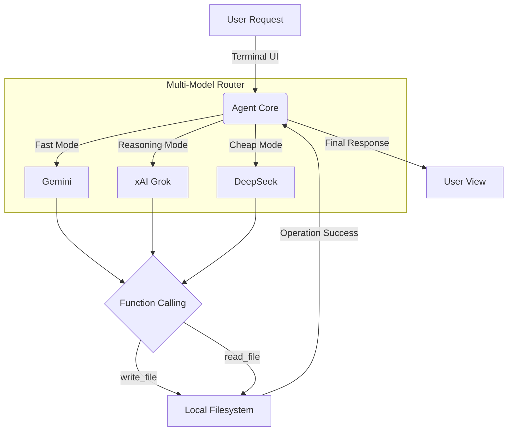

# Grok Code
<div align="center">
  
  
  
</div>

<br/>

**Grok Code** is an advanced, terminal-native agentic coding environment. Engineered for speed and autonomy, it seamlessly integrates with your local workspace, reads your codebase, formulates execution plans, and autonomously modifies files to fulfill complex software requirements.

Designed for developers who demand full control, Grok Code features a **Dynamic Multi-Model Router**—allowing you to leverage the reasoning power of Grok, the cost-efficiency of DeepSeek, or the raw speed of Gemini, all through a beautifully crafted Terminal User Interface (TUI).

---

## ⚡ Core Architecture

Grok Code operates on a continuous Agentic Loop, intercepting Natural Language requests and translating them into deterministic local file operations using strict JSON schemas.



## ✨ Key Features

- **Autonomous Code Execution**: Define a task, and the agent will recursively plan, write, and verify code directly in your local environment.
- **Provider Agnostic**: Switch between top-tier LLMs instantly without altering your workflow. Fully compatible with any OpenAI-spec endpoint.
- **Privacy First**: Zero telemetry. Your codebase never leaves your machine unless explicitly sent to the AI provider you configure.
- **Frictionless UI**: Built on top of `Bubble Tea` and `Lipgloss` for a high-performance, artifact-free visual experience right in your terminal.

## 🚀 Installation

Pre-compiled binaries are available for seamless integration into your toolchain.

**MacOS / Linux (Recommended)**
```bash
curl -fsSL https://raw.githubusercontent.com/holasoymalva/grok-code/main/install.sh | bash
```

**Go Developers**
```bash
go install github.com/holasoymalva/grok-code/cmd/grokcode@latest
```

## ⚙️ Configuration

Grok Code uses a simple, declarative configuration model. On your first run, a `config.yaml` will be generated (or fallback to public endpoints).

```yaml
default_model: "grok"

providers:
  xai:
    base_url: "https://api.x.ai/v1"
    api_key: "xai-..."
  deepseek:
    base_url: "https://api.deepseek.com/v1"
    api_key: "sk-..."
```

## 📖 Usage

Navigate to any project directory and initialize the environment:

```bash
cd /path/to/your/project
grokcode chat
```

Use natural language to direct the agent. Type `/exit` or press `Ctrl+C` to cleanly terminate the session.

## 🤝 Contributing

We welcome contributions from the community. Please review our architectural guidelines before submitting large feature requests. 

1. Fork the Project
2. Create your Feature Branch (`git checkout -b feature/AmazingFeature`)
3. Commit your Changes (`git commit -m 'Add some AmazingFeature'`)
4. Push to the Branch (`git push origin feature/AmazingFeature`)
5. Open a Pull Request

## 📄 License

Distributed under the MIT License. See `LICENSE` for more information.
